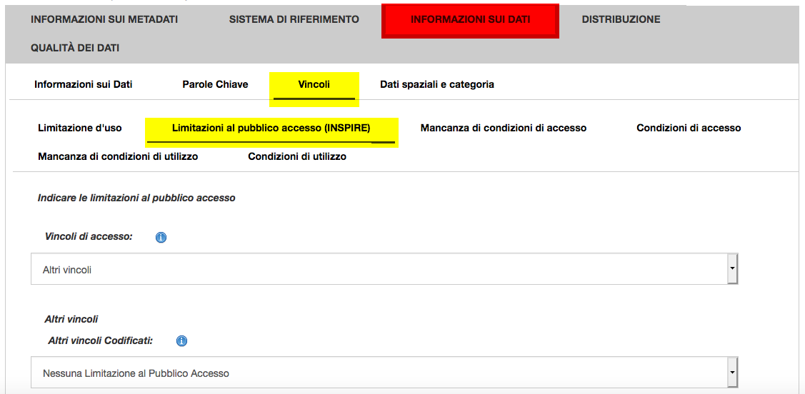
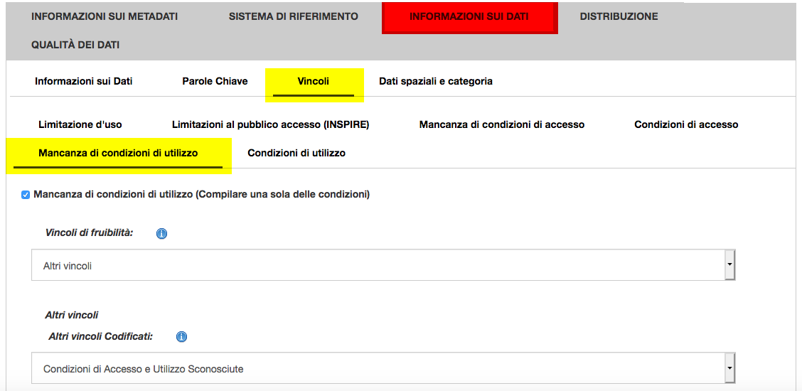
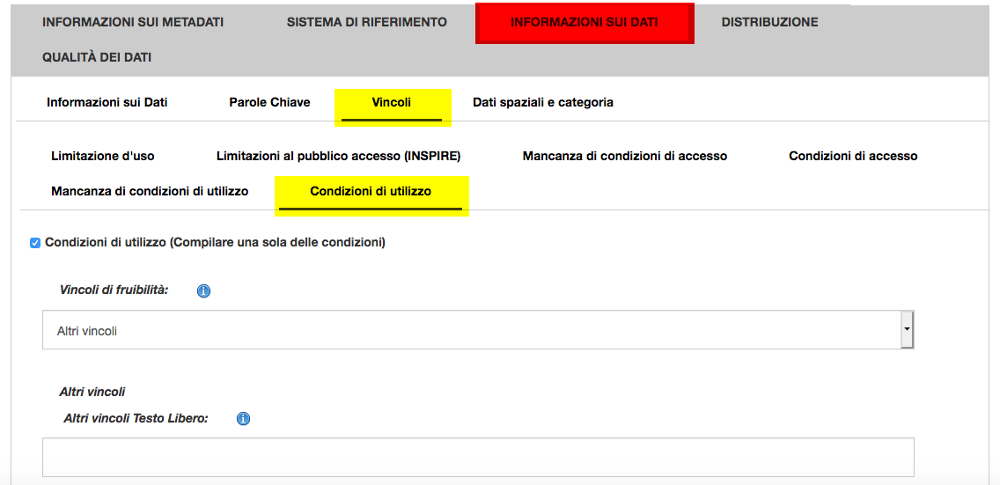

## 2.4 Vincoli sui dati

**Elementi:**

[2.4.1 Limitazione d'uso](constraints.md#241-limitazione-duso)

[2.4.2 Vincoli di accesso](constraints.md#242-vincoli-di-accesso)

[2.4.3 Vincoli di fruibilità](constraints.md#243-vincoli-di-fruibilità)

### 2.4.1 Limitazione d&#39;uso

|  |  |
| --- | --- |
| **Nome elemento** | Limitazione d&#39;uso |
| **Riferimento** | [LG RNDT] – tab. I-26, tab. V-22, tab. VII-19 |
| **Molteplicità** | [0..1] |
| **Elemento INSPIRE** | Nessun elemento corrispondente |
| **Definizione** | Restrizioni di utilizzo dei dati. |
| **Istruzioni di implementazione** | Testo libero. |

***Raccomandazione RC.12** - **```rndt/metadata/2.0/rec/common/use-limitation```***

*L&#39;elemento ```gmd:resourceConstraints/gmd:MD_Constraints/gmd:useLimitation``` può essere utilizzato per indicare eventuali limitazioni che incidono sull&#39;idoneità all&#39;uso della risorsa documentata.*

*La molteplicità dell&#39;elemento è 0..1.*

---

**Esempio di XML:**

```xml
<gmd:MD_Metadata>
…
  <gmd:identificationInfo>
    <gmd:MD_DataIdentification>
    …
      <gmd:resourceConstraints>
        <gmd:MD_Constraints>
          <gmd:useLimitation>
            <gco:CharacterString>L’utilizzo è limitato solo ai Comuni</gco:CharacterString>
          </gmd:useLimitation>
          …
        </gmd:MD_Constraints>
      </gmd:resourceConstraints>
      …
    </gmd:MD_DataIdentification>
  </gmd:identificationInfo>
…
</gmd:MD_Metadata>
```

### 2.4.2 Vincoli di accesso

|  |  |
| --- | --- |
| **Nome elemento** | Vincoli di accesso |
| **Riferimento** | [LG RNDT] – tab. I-27, tab. V-23 |
| **Molteplicità** | [1..\*] |
| **Elemento INSPIRE** | Vincoli per l&#39;accesso pubblico |
| **Definizione** | Informazioni sulle limitazioni e le relative motivazioni imposte all&#39;accesso pubblico ai set di dati territoriali e ai servizi a essi relativi a norma dell&#39;articolo 13 della Direttiva 2007/2/CE. |
| **Istruzioni di implementazione** | Devono essere forniti i seguenti elementi: - _gmd:accessConstraints_ con valore &quot;Altri vincoli&quot; (otherRestrictions) dell&#39;elenco di codici &quot;_MD\_RestrictionCode_&quot; (§ 4.2.3.12 [LG RNDT]); - _gmd:otherConstraints_ con testo libero. |

**REQUISITO C.17** - **```metadata/2.0/req/common/limitations-on-public-access```**

I vincoli per l&#39;accesso pubblico (o la mancanza di tali vincoli) per la risorsa descritta devono essere indicati utilizzando uno ed un solo elemento _```gmd:resourceConstraints/gmd:MD_LegalConstraints```_. Questo elemento non deve essere lo stesso utilizzato per descrivere i [vincoli di fruibilità - condizioni applicabili all&#39;accesso e all&#39;uso](constraints.md#243-vincoli-di-fruibilità).

Per indicare i vincoli per l&#39;accesso pubblico basati sui motivi di cui alla lettera (a) o alle lettere da (c) ad (h) dell&#39;art. 13 paragrafo 1 della Direttiva INSPIRE, l&#39;elemento _```gmd:resourceConstraints/gmd:MD_LegalConstraints```_ deve includere una combinazione di:

- una istanza dell&#39;elemento _```gmd:accessConstraints/gmd:MD_RestrictionCode```_ con il valore &quot;Altri vincoli&quot; (&quot;otherRestrictions&quot;) presente nell&#39;elenco di codici ISO _```MD_RestrictionCode```_;

- almeno una istanza di _```gmd:otherConstraints/gmx:Anchor```_ con l&#39;attributo _```xlink:href```_ riferito all&#39;URI di uno dei valori dell&#39;elenco di codici _```LimitationsOnPublicAccess```_ definito nel relativo [registro pubblicato nel Sistema di Registri INSPIRE](http://inspire.ec.europa.eu/metadata-codelist/LimitationsOnPublicAccess). Se non ci sono vincoli all&#39;accesso pubblico, l&#39;elemento deve puntare al valore &quot;_noLimitations_&quot; dell&#39;elenco di codici di cui sopra.

---

***Raccomandazione RC.13** - **```rndt/metadata/2.0/rec/common/security-constraints```***

*Nel caso in cui i vincoli per l&#39;accesso pubblico sono basati sui motivi di cui alla lettera (b) dell&#39;art. 13 paragrafo 1 della [Direttiva INSPIRE], si può utilizzare l&#39;elemento ```gmd:resourceConstraints/gmd:MD_SecurityConstraints/gmd:classification/gmd:MD_ClassificationCode``` con riferimento all&#39;elenco di codici ```MD_ClassificationCode```.*

---

**Esempi di XML:**

```xml
<gmd:MD_Metadata>
…
  <gmd:identificationInfo>
    <gmd:MD_DataIdentification>
    …
      <gmd:resourceConstraints>
      …
        <gmd:MD_LegalConstraints>
          <gmd:accessConstraints>
            <gmd:MD_RestrictionCode codeList=" http://standards.iso.org/iso/19139/resources/gmxCodelists.xml#MD_RestrictionCode" codeListValue="otherRestrictions">altri vincoli</gmd:MD_RestrictionCode>
          </gmd:accessConstraints>
          <gmd:otherConstraints>
            <gmx:Anchor xlink:href="http://inspire.ec.europa.eu/metadata-codelist/LimitationsOnPublicAccess/INSPIRE_Directive_Article13_1a">Accesso pubblico limitato ai sensi dell'articolo 13, paragrafo 1, lettera a), della direttiva INSPIRE</gmx:Anchor>
          </gmd:otherConstraints>
        </gmd:MD_LegalConstraints>
      </gmd:resourceConstraints>
      …
    </gmd:MD_DataIdentification>
  </gmd:identificationInfo>
…
</gmd:MD_Metadata>
```

```xml
<gmd:MD_Metadata>
…
  <gmd:identificationInfo>
    <gmd:MD_DataIdentification>
    …
      <gmd:resourceConstraints>
      …
        <gmd:MD_LegalConstraints>
          <gmd:accessConstraints>
            <gmd:MD_RestrictionCode codeList=" http://standards.iso.org/iso/19139/resources/gmxCodelists.xml#MD_RestrictionCode" codeListValue="otherRestrictions">altri vincoli</gmd:MD_RestrictionCode>
          </gmd:accessConstraints>
          <gmd:otherConstraints>
            <gmx:Anchor xlink:href="http://inspire.ec.europa.eu/metadata-codelist/LimitationsOnPublicAccess/noLimitations">Nessun vincolo all’accesso pubblico</gmx:Anchor>
          </gmd:otherConstraints>
        </gmd:MD_LegalConstraints>
      </gmd:resourceConstraints>
      …
    </gmd:MD_DataIdentification>
  </gmd:identificationInfo>
…
</gmd:MD_Metadata>
```

```**EDITOR**```

Per indicare i vincoli all'accesso basati sui motivi di cui all'art. 13 della Direttiva INSPIRE attraverso l'editor, selezionare i tab ```INFORMAZIONI SUI DATI``` --> ```Vincoli``` --> ```Limitazioni al pubblico accesso (INSPIRE)``` e scegliere i valori pertinenti secondo le indicazioni del Requisito di cui sopra (v. figura che segue).



---


### 2.4.3 Vincoli di fruibilità

|  |  |
| --- | --- |
| **Nome elemento** | Vincoli di fruibilità |
| **Riferimento** | [LG RNDT] – tab. I-28, tab. V-24 |
| **Molteplicità** | [1..\*] |
| **Elemento INSPIRE** | Condizioni applicabili all&#39;accesso e all&#39;uso |
| **Definizione** | Condizioni applicabili all&#39;accesso e all&#39;uso dei set di dati territoriali e ai relativi servizi e, dove applicabile, ai canoni corrispondenti, a norma dell&#39;articolo 5, comma 2, lettera b), e dell&#39;articolo 11, comma 2, lettera f), della Direttiva 2007/2/CE. |
| **Istruzioni di implementazione** | Devono essere forniti i seguenti elementi: - _gmd:accessConstraints_ oppure _gmd:useConstraints_ con valore &quot;Altri vincoli&quot; (otherRestrictions) dell&#39;elenco di codici &quot;_MD\_RestrictionCode_&quot; (§ 4.2.3.12 [LG RNDT]); - _gmd:otherConstraints_ con testo libero. |

<a name=C.18>**REQUISITO C.18**</a> - **```metadata/2.0/req/common/conditions-for-access-and-use```**

I vincoli di fruibilità (condizioni applicabili all&#39;accesso e all&#39;uso) per la risorsa descritta devono essere indicati utilizzando uno ed un solo elemento _```gmd:resourceConstraints/gmd:MD_LegalConstraints```_. Questo elemento non deve essere lo stesso utilizzato per descrivere i [vincoli per l&#39;accesso pubblico](constraints.md#242-vincoli-di-accesso).

L&#39;elemento _```gmd:resourceConstraints/gmd:MD_LegalConstraints```_ deve includere una combinazione di:

- una istanza dell&#39;elemento _```gmd:accessConstraints/gmd:MD_RestrictionCode```_ o dell&#39;elemento _```gmd:useConstraints/gmd:MD_RestrictionCode```_ con il valore &quot;Altri vincoli&quot; (&quot;otherRestrictions&quot;) presente nell&#39;elenco di codici ISO _```MD_RestrictionCode```_;

- almeno una istanza di _```gmd:otherConstraints```_ attraverso cui descrivere le condizioni effettive.

Se non è applicabile nessuna condizione, _```gmd:otherConstraints```_ deve includere un elemento _```gmx:Anchor```_ con l&#39;attributo _```xlink:href```_ riferito all&#39;URI del valore &quot;_Nessuna condizione applicabile_&quot; (_noConditionsApply_) dell&#39;elenco di codici _```ConditionsApplyingToAccessAndUse```_, definito nel relativo [registro pubblicato nel Sistema di Registri INSPIRE](http://inspire.ec.europa.eu/metadata-codelist/ConditionsApplyingToAccessAndUse).

Se le condizioni non sono note, _```gmd:otherConstraints```_ deve includere un elemento _```gmx:Anchor```_ con l&#39;attributo _```xlink:href```_ riferito all&#39;URI del valore &quot;_Condizioni sconosciute_&quot; (_conditionsUnknown_) dell&#39;elenco di codici _```ConditionsApplyingToAccessAndUse```_, definito nel relativo registro di cui sopra.

Negli altri casi _```gmd:otherConstraints```_ deve includere un testo libero con la descrizione, nella lingua dei metadati, dei termini e delle condizioni, inclusi anche, se applicabili, i costi corrispondenti dei dati o un link (URL) dove tali termini e condizioni sono descritti.

---

***Raccomandazione RC.14** - **```rndt/metadata/2.0/rec/common/licences```***

*Per informazioni dettagliate sulla licenza della risorsa, si raccomanda di indicare un link al tipo di licenza, ad un sito o a un documento contenente le informazioni necessarie.*

*Per l&#39;indicazione della licenza applicata ai dati, possono essere utilizzati gli URI delle licenze definiti nel vocabolario Licence pubblicato dall&#39;Ufficio delle pubblicazioni dell&#39;UE (URI [http://publications.europa.eu/resource/authority/licence](http://publications.europa.eu/resource/authority/licence)).*

---

**Esempi di XML:**

```xml
<gmd:MD_Metadata>
…
  <gmd:identificationInfo>
    <gmd:MD_DataIdentification>
    …
      <gmd:resourceConstraints>
        <gmd:MD_LegalConstraints>
        …
          <gmd:useConstraints>
            <gmd:MD_RestrictionCode codeList=" http://standards.iso.org/iso/19139/resources/gmxCodelists.xml#MD_RestrictionCode" codeListValue="otherRestrictions">altri vincoli</gmd:MD_RestrictionCode>
          </gmd:useConstraints>
          <gmd:otherConstraints>
            <gmx:Anchor xlink:href="http://inspire.ec.europa.eu/metadata-codelist/ ConditionsApplyingToAccessAndUse/noConditionsApply">Nessuna condizione applicabile</gmx:Anchor>
          </gmd:otherConstraints>
        </gmd:MD_LegalConstraints>
      </gmd:resourceConstraints>
      …
    </gmd:MD_DataIdentification>
  </gmd:identificationInfo>
  …
  </gmd:MD_Metadata>
  ```
  
```xml
<gmd:MD_Metadata>
…
  <gmd:identificationInfo>
    <gmd:MD_DataIdentification>
    …
      <gmd:resourceConstraints>
        <gmd:MD_LegalConstraints>
          <gmd:accessConstraints>
            <gmd:MD_RestrictionCode codeList=" http://standards.iso.org/iso/19139/resources/gmxCodelists.xml#MD_RestrictionCode" codeListValue="otherRestrictions">altri vincoli</gmd:MD_RestrictionCode>
          </gmd:accessConstraints>
          <gmd:otherConstraints>
            <gco:CharacterString>L’accesso e la fruibilità dei dati sono pubblici</gco:CharacterString>
          </gmd:otherConstraints>
        </gmd:MD_LegalConstraints>
      </gmd:resourceConstraints>
      …
    </gmd:MD_DataIdentification>
  </gmd:identificationInfo>
  …
  </gmd:MD_Metadata>
  ```

```xml
<gmd:MD_Metadata>
…
  <gmd:identificationInfo>
    <gmd:MD_DataIdentification>
    …
      <gmd:resourceConstraints>
        <gmd:MD_LegalConstraints>
          <gmd:useConstraints>
            <gmd:MD_RestrictionCode codeList=" http://standards.iso.org/iso/19139/resources/gmxCodelists.xml#MD_RestrictionCode" codeListValue="otherRestrictions">altri vincoli </gmd:MD_RestrictionCode>
          </gmd:useConstraints>
          <gmd:otherConstraints>
            <gco:CharacterString> http://publications.europa.eu/resource/authority/licence/CC_BY_4_0</gco:CharacterString>
          </gmd:otherConstraints>
        </gmd:MD_LegalConstraints>
      </gmd:resourceConstraints>
      …
    </gmd:MD_DataIdentification>
  </gmd:identificationInfo>
  …
  </gmd:MD_Metadata>
  ```
  
  
```**EDITOR**```

Per indicare le condizioni applicabili all'accesso e all'uso attraverso l'editor:

  - nel caso in cui le condizioni non siano note o nessuna condizione è applicabile, selezionare i tab ```INFORMAZIONI SUI DATI``` --> ```Vincoli``` --> ```Mancanza di condizioni di utilizzo``` e scegliere i valori pertinenti secondo le indicazioni del Requisito di cui sopra (v. figura che segue);
  
  
  
  - nel caso di condizioni da dover descrivere attraverso testo libero, selezionare i tab ```INFORMAZIONI SUI DATI``` --> ```Vincoli``` --> ```Condizioni di utilizzo``` e inserire il testo nel campo "Altri vincoli - Testo libero" secondo le indicazioni del Requisito di cui sopra (v. figura che segue).



---

Vai a [**2.5 Estensione dei dati**](extent.md)
